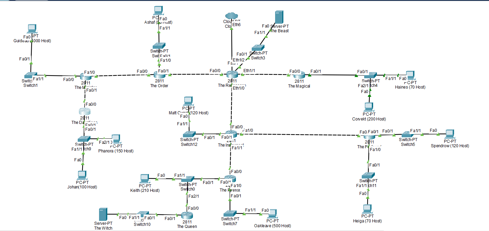
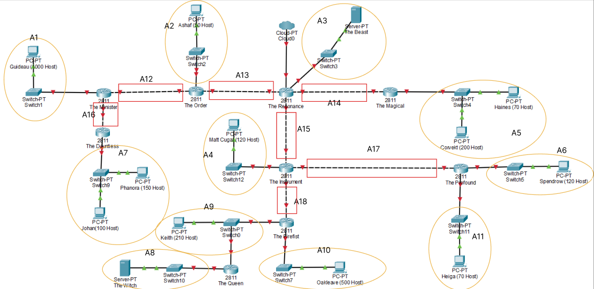
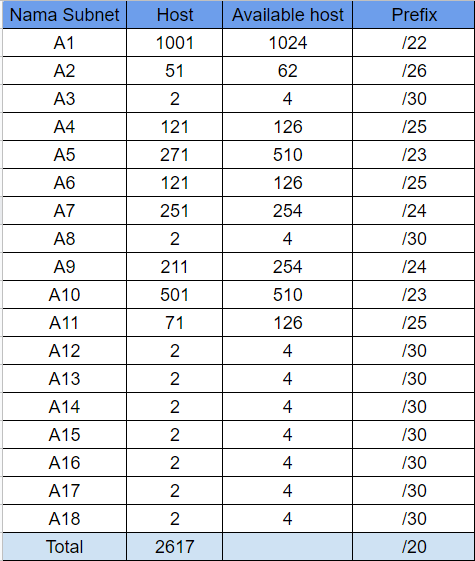
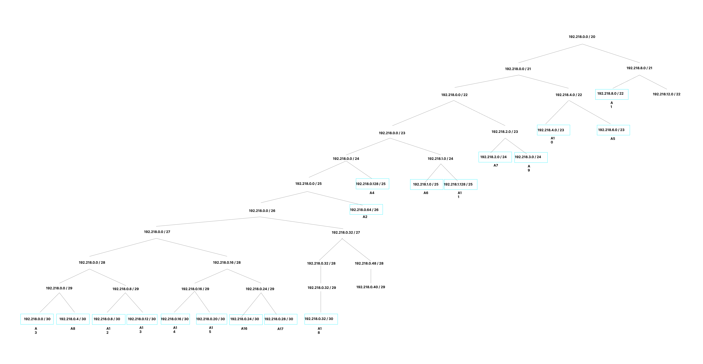
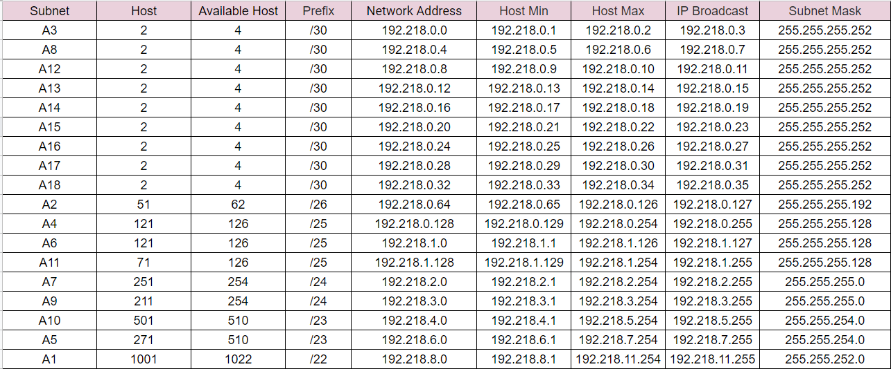
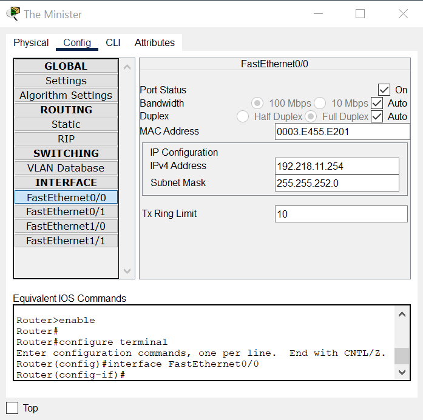
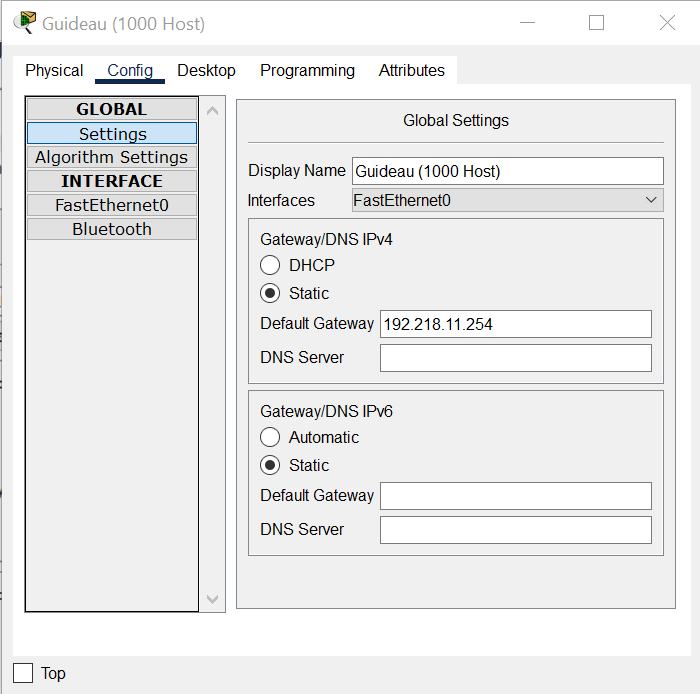
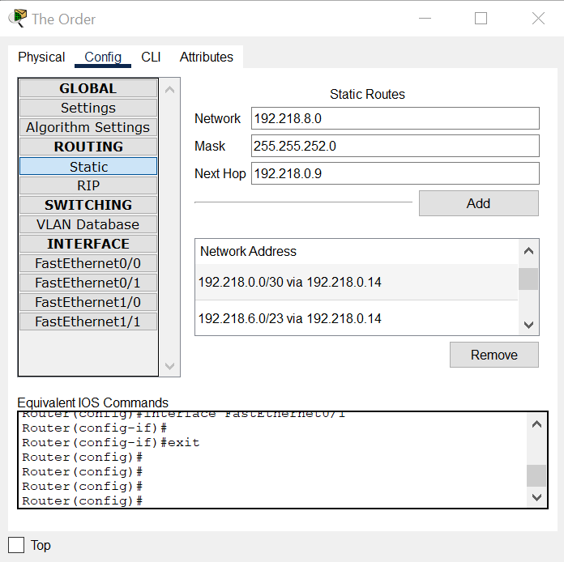
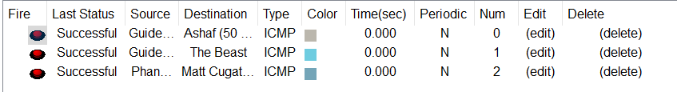

# Jarkom-Modul-4-ITB08-2022

## Anggota:
| Nama                      | NRP        |
|---------------------------|------------|
| Salsabila Briliana A. S.  | 5027201003 |
| Muhammad Rifqi Fernanda   | 5027201050 |
| Gilang Bayu Gumantara     | 5027201062 | 


## Topologi CPT
---


## VLSM
---
Pertama, kami membagi topologi kedalam beberapa bagian kecil.


Selanjutnya menghitung berapa jumlah host pada setiap subnet dan netmask yang akan digunakan.



Major network nya berada pada netmask /20. Prefix IP kelompok kami adalah 192.218.X.X. Selanjutnya kami membuat pohon perhitungan VLSM


Untuk table perhitungannya adalah sebagai berikut :


Selanjutnya yaitu, memasukkan ip pada setiap node cohtoh pada subnet A1

```
Subnet A1 : 
    NID : 192.218.8.0
    Netmask : 255.255.252.0
    IP range : 192.218.8.1 - 192.218.11.254
```

Selanjutnya yaitu mengatur router, contohnya pada The Minister terhubung dengan Guideau pada interface `Fa0/0`. maka ip pada `interface Fa0/0` diatur dengan IP range yang tersedia sebagai berikut:


Setelah mengatur IP pada The Minister, selanjutnya kita mengatur IP pada Guideau dengan IP range yang telah tersedia sebagai berikut:


Setelah berhasil mengatur IP pada subnet A1, selanjutnya mengatur IP setiap subnet sampai A18 sesuai dengan hasil perhitungan yang telah didapatkan sebelumnya. Karena terlalu banyak, kami hanya mencontohkan assign IP pada satu subnet saja. Untuk assign lengkap nya dapat di akses melalui <a href="https://github.com/SalsabilaB/Jarkom-Modul-4-ITB08-2022/blob/main/modul4.pkt"><b style="color:red">link berikut ini</b></a> 

Setelah semua Node sudah diatur IP nya, selanjutnya yaitu melakukan routing agar semua node saling terhubung. Cara melakukan konfigurasinya adalah dengan masuk pada config ROUTING. Disana dapat mengisikan Netrwork , Mask, dan Next Hop yang ditujukan. Sebagai contoh penjelasan, kita ambil Router The Order. The order terhubung dengan router The Minister, sehingga konfigurasi pada router The Order yaitu:



Selanjutnya yaitu memastikan semua node telah terhubung.


## Topologi GNS3
---


## CIDR
---
- Selanjutnya menghitung berapa jumlah host pada setiap subnet dan netmask yang akan digunakan.


- Pembagian subnetting


-  Selanjutnya kami membuat pohon perhitungan CIDR


